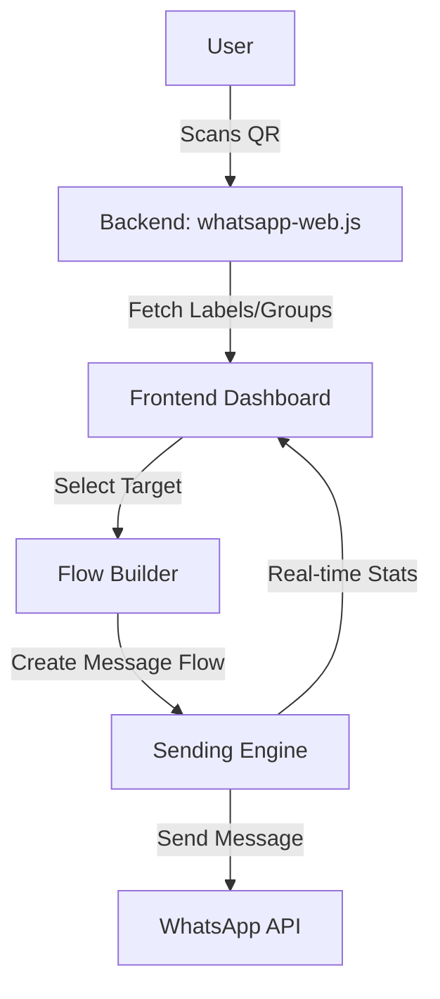

# Flows Graph

```mermaid
graph TD
    A[User] -->|Scans QR| B[Backend: whatsapp-web.js]
    B -->|Fetch Labels/Groups| C[Frontend Dashboard]
    C -->|Select Target| D[Flow Builder]
    D -->|Create Message Flow| E[Sending Engine]
    E -->|Real-time Stats| C
    E -->|Send Message| F[WhatsApp API]
```
