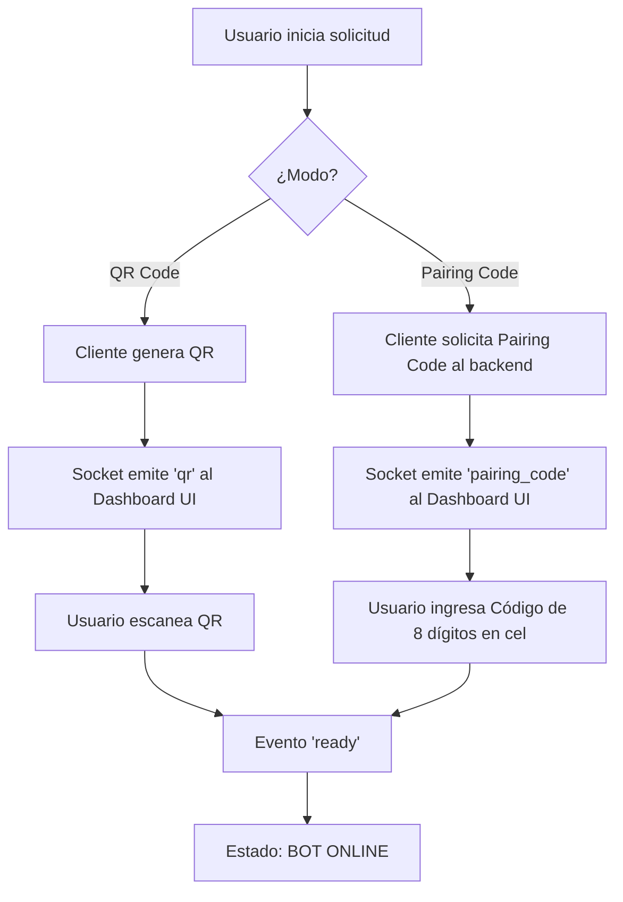

# Grafos de Lógica y Flujos del Sistema

## 1. Conexión de WhatsApp Web



## 2. Motor de Envío Masivo de Campañas

```mermaid
flowchart TD
    A[UI lanza Campaña] --> B[POST /api/campaigns]
    B --> C[Obtener destinatarios de Listas Virtuales / Etiquetas]
    C --> D[Aplicar exclusión por período anti-spam (48h, 7d, etc.)]
    D --> E[Para cada contacto de la lista]
    E --> F{¿Campaña cancelada o Bot Desconectado?}
    F -- Sí --> G[Abortar campaña y emitir estado]
    F -- No --> H[Seleccionar variante de mensaje del flujo]
    H --> I[sendMessage via Puppeteer]
    I --> J[Registrar en SQLite `logs`]
    J --> K[Wait de delay con check cada 500ms]
    K --> E
```
